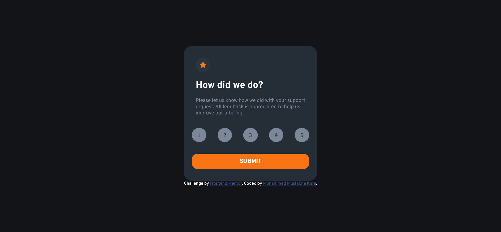
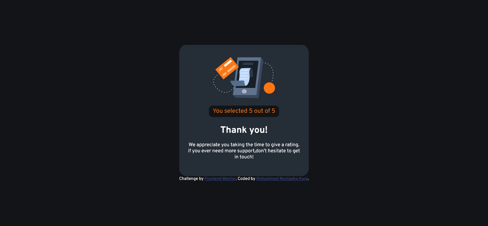

# Frontend Mentor - Interactive rating component solution

This is a solution to the [Interactive rating component challenge on Frontend Mentor](https://www.frontendmentor.io/challenges/interactive-rating-component-koxpeBUmI). Frontend Mentor challenges help you improve your coding skills by building realistic projects. 

## Table of contents

- [Overview](#overview)
  - [The challenge](#the-challenge)
  - [Screenshot](#screenshot)
  - [Built with](#built-with)
  - [What I learned](#what-i-learned)
  - [Continued development](#continued-development)
  - [Useful resources](#useful-resources)
- [Author](#author)
- [Acknowledgments](#acknowledgments)

**Note: Delete this note and update the table of contents based on what sections you keep.**

## Overview
This is is my first attempt at using html, css and js. I am aware of my inexperience and i'm willing to implement suggestions on how i can improve my solutions and also ready to learn and implement new concepts. 
### The challenge

Users should be able to:

- View the optimal layout for the app depending on their device's screen size
- See hover states for all interactive elements on the page
- Select and submit a number rating
- See the "Thank you" card state after submitting a rating

### Screenshot

### Links

- Solution URL: [Add solution URL here](https://your-solution-url.com)
- Live Site URL: [Add live site URL here](https://your-live-site-url.com)

## My process

### Built with

- Semantic HTML5 markup
- CSS custom properties
- Flexbox

### What I learned

i learnt a lot about flexbox during this project especially the align-self property.

### Continued development

This project has made me realize how much i didn't know about flexbox and css grid and i'm looking forward to learning more about them.

### Useful resources

- [w3schools](https://www.w3schools.com/)
- [Stack Overflow](https://stackoverflow.com/)

## Author

- Frontend Mentor - [@mmustaphk](https://www.frontendmentor.io/profile/mmustaphak)
- Twitter - [@mmustaphak1](https://www.twitter.com/mmustaphak1)

## Acknowledgments

I would like to use this opportunity to acknowledge a good friend of my Esin Ridollah
- Twitter - [@esinnation](https://www.frontendmentor.io/profile/esinnation)
